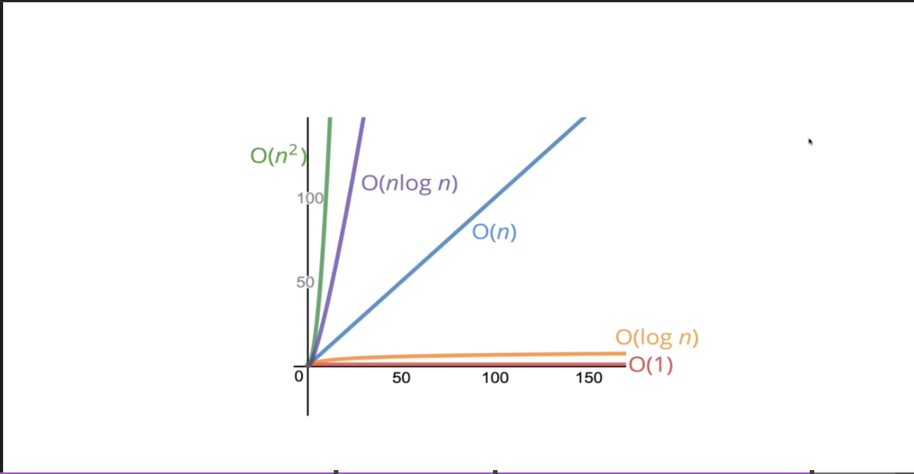

# JavaScript Algorithm

## This is to save what I learnt from Javascript algorithms - Colt Steele udemy course for future reference and a folder to save my problem exercises. 

### BIG O NOTATION

-   Big O Notation is a way to formalize fuzzy counting. We won’t care about the details, only the trends.
-  the timeframe chart is going to change relative to input ( could be linear, quadratic n2, constant =1

- Regardless of the exact number, the number of operations grows roughly **proportionally with n**

